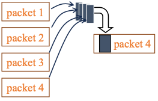
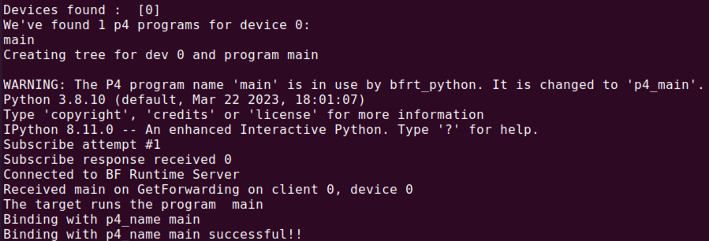
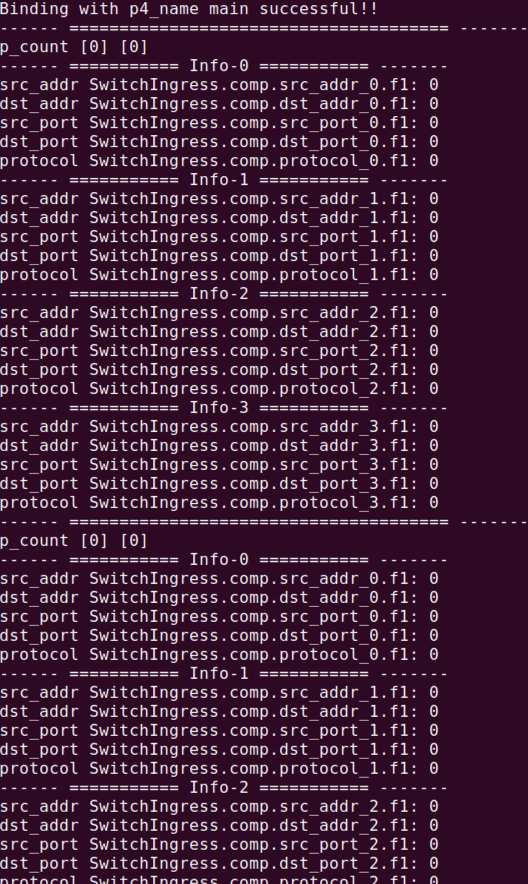
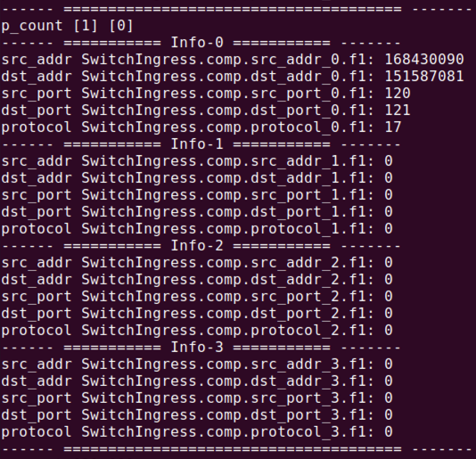
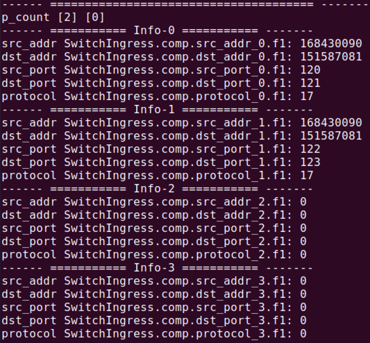
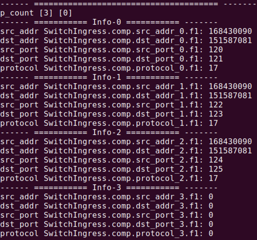
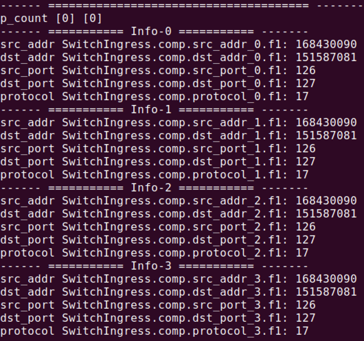

# Comp header
This repo is part of a project that compresses 5-tuple of 4 packets into 1 packet using p4, as shown in Figure 1. <br>
 <br>
## Preparation
### Build
```bash
/path/to/the/tools/p4_build.sh /path/to/this/folder/p4-build/main.p4 --with-tofino2
```
### Run tofino model
```bash
# terminal 1
/${SDE}/run_tofino_model.sh -p main --arch Tofino2
```
### Run switch driver
```bash
# terminal 2
/${SDE}/run_switchd.sh -p main --arch Tofino2
```
### Run reading register code
```bash
# terminal 3
${SDE_INSTALL}/bin/bfshell -b /path/to/the/this/folder/cont_or_host/read_comp_main.py
```
You can get the result below: <br>
 <br>
You can also see each register value like below: <br>
 <br>

## A little simulation experiment
### Send a simple packet
```bash
sudo python3 sendtcpudp.py 10.10.10.10 9.9.9.9 120 121 udp 1 hello fixed veth1
sudo python3 sendtcpudp.py 10.10.10.10 9.9.9.9 122 123 udp 1 hello fixed veth1
sudo python3 sendtcpudp.py 10.10.10.10 9.9.9.9 124 125 udp 1 hello fixed veth1
sudo python3 sendtcpudp.py 10.10.10.10 9.9.9.9 126 127 udp 1 hello fixed veth1
```
You can see the result like this: <br>



 <br>
